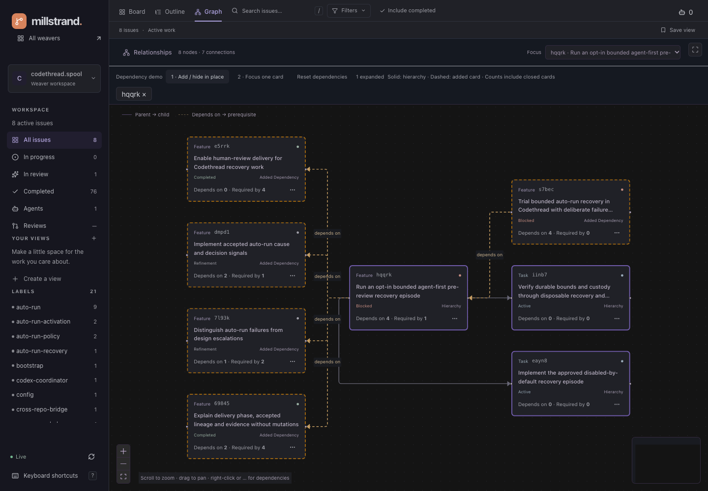
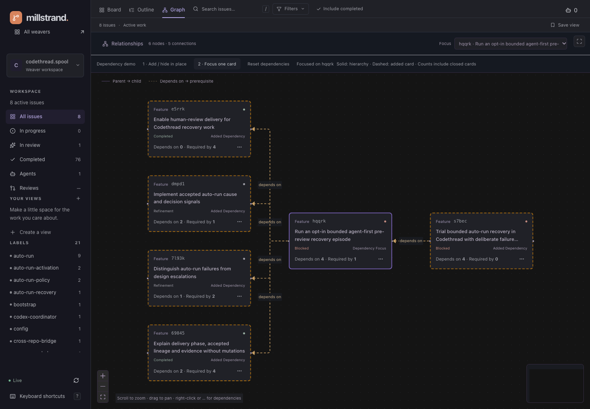
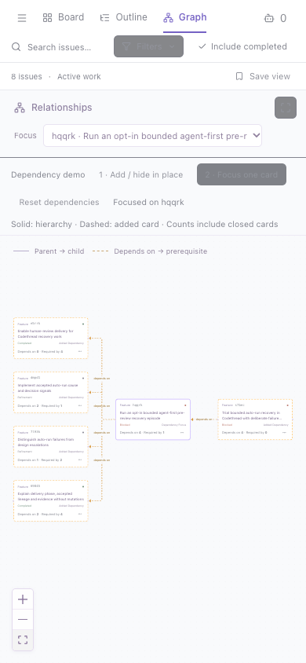

# Graph surface ownership

`IssueSurface` passes the stable `cards`/`allCards` projection from
`useIssueBoard`/`issueSurfaceContent` to `GraphView`. Board startup and retained
board-error feedback stay in the shell. An empty filtered board still mounts the
graph toolbar, so a focused graph is reachable.

- `src/hooks/use-graph.ts`: `useGraphSource` composes board `graphFromCards` or
  the owning epic’s focused `useGraph` query (or the standalone card’s query) (`graphQueryOptions` in `src/lib/api/cards.ts`).
  The mounted graph is the focused query's 10-second poll owner. There is no new
  key, cache, timer or mirrored snapshot. `GraphSource` distinguishes loading,
  unavailable, and successful data with nullable refresh error. A failed refresh
  retains the graph and explicitly labels it last-known; initial failure is not
  rendered as successful empty data.
- `src/components/graph-view.tsx`: Router focus/filter selection, toolbar, source
  notices and memoized layout. `GraphSourceNotice` and `GraphEmpty` render explicit
  loading/error/empty/too-large states. Only graph data, dependency data, URL exploration and includeClosed
  enter layout memoization, never query wrappers, fetchedAt or composer drafts.
- `src/lib/graph.ts`: pure `graphFromCards`, `layoutGraph`, `graphStatus`,
  `graphBody`, and concrete source/layout types. Query structural sharing retains
  unchanged focused graph input; the issue projection retains unchanged board
  input. Dagre stays synchronous and unchanged as the layout engine.
- `src/components/graph-canvas.tsx`: `GraphCanvas` renders React Flow and the
  local task/work inspector. Epic/feature activation delegates to Router issue
  selection. Enter/Space activation matches clicking. Markdown and prompt entry
  come from shared leaves, not other page implementations.

## Deliberate lifecycle

The canvas key is serialized **URL focus, dependency exploration and filter values**, not graph membership
or object identity. Focus/filter navigation (including Back) resets local inspector
selection and fits the new graph. Workspace/page unmount also resets it. Unchanged
polls, refresh health, prompt drafts and ordinary data updates do not remount the
canvas or refit pan/zoom. Membership changes from a poll update the controlled
nodes/edges without forcibly recentering; Fit View remains available. A selected
inspector is shown only while its ID is present in the current layout. Empty and
too-large layouts unmount the canvas; returning to a renderable graph fits again.
The existing navigation contract still clears focus on manual filter changes.

## Semantics

Unfocused graphs include matching issues and their epic context, not unmatched
siblings. Focused graphs retain the focused root and transitive ancestors of live
nodes even if closed; other closed nodes require includeClosed. Parent arrows point
parent → child. Dependency arrows are explicit opt-in and point dependent → prerequisite, while Dagre
positions prerequisites before dependents. Only edges with both actual endpoints
are laid out. An open node with a visible open prerequisite is blocked; the subtree
cannot prove readiness against external dependencies. Empty is explicit; more than
150 visible nodes (after filtering/context inclusion) produces the narrowing notice.

## Verification for 45mjy

`pnpm quality`: strict TS, zero-warning Oxlint, 294 Vitest tests and production
build pass. `src/lib/graph.test.ts` covers shared issue membership/context,
transitive closed ancestors/root, dependency direction/placement/blocking, dangling
edges and the 150-node boundary. `src/components/graph-view.test.tsx` covers source
notices and empty/too-large distinctions.

Browser checks used real local workspace reads at 1440×1000 and 390×844:

- Unfocused and focused graphs; zoom controls and drag pan; keyboard Enter task
  inspector and Space feature detail; pane/inspector close; detail Back and reload.
- Focused and unfocused ordinary polls retained the exact viewport element and
  pan/zoom transform; focused task inspection survived a poll. Prompt draft entry
  and cancellation left viewport/selection intact, with no launch submitted.
- Closed feature vl3cr remained as the sole root when closed tasks were excluded;
  includeClosed plus focus showed all five nodes. Filter change reset the canvas;
  Back restored the URL filter and excluded closed nodes. Zero search matches kept
  the focus selector usable.
- Browser-scoped graph request delay showed loading; initial abort showed error
  without empty prose. Refresh abort retained viewport, transform and inspector
  with last-known feedback. A browser-only 151-node response showed the size notice.
  All request overrides were removed; no database fixtures or real work were mutated
  for smoke testing. No paid agent launch or external review publication occurred.
- Narrow canvas/inspector controls remained usable with document width equal to the
  390px viewport. Browser reported no uncaught page errors.

## Direct dependency demos (jy52w)

Right-click a Graph card or use its **…** button. Board/Outline card menus also
open either dependency demo directly. Each graph card shows **Depends on**
(outgoing prerequisites) and **Required by** (incoming dependents), counted across
the workspace including closed work, never just the visible graph.

- **1 · Add / hide in place** unions the direct neighbours of explicitly expanded
  cards with the current hierarchy. Expand another card to add another hop. Hide
  it from its menu or the removable ID chips; shared nodes/edges remain when another
  expanded card still needs them. Reset removes all expansions.
- **2 · Focus one card** shows only that card and its direct prerequisites/dependents.
  Choosing another card replaces the neighbourhood. Hide/Reset restores the original
  hierarchy. Browser Back restores earlier neighbourhoods.
- Solid violet borders and **Hierarchy** mean membership in the original graph;
  dashed amber borders and **Added dependency** identify added cards. The focused
  card has a ring and **Dependency focus** label. This is hierarchy membership,
  not a claim that every added card belongs to a different epic.
- Closed dependency neighbours remain visible even when **Include completed** is
  off, because the user explicitly requested those relationships. Counts stay
  independent of all filters. No recursive expansion occurs automatically.
- `graphDependencies` is a URL discriminated union: `expand` with IDs or `focus`
  with a nullable ID. Focus/filter changes clear exploration. Discrete exploration
  refits the canvas; ordinary polls retain pan/zoom and selection.

`GET /api/dependencies` returns a `CardGraph` containing workspace-wide dependency
edges and only their endpoints. `WorkspaceDatabase.readDependencies` uses one
read-only, bounded SQL snapshot discovered through `mill weaver list`, with the
existing schema/storage validation and 10,000-node / 50,000-edge overflow failures.
Only identity, title, lifecycle, timestamps and allowlisted kind/lane metadata are
selected; no arbitrary attributes or agent payloads. No Strand mutations occur.
The mounted `GraphView` owns `['dependencies', workspace]` through `useDependencies`
at 10 seconds. No per-node requests or polling owners are added. Missing data shows
unavailable counts, not zeros; refresh failures retain data with visible last-known
feedback. Card mutations await invalidation of this key too.

### Verification

`pnpm quality` passes (365 tests). Pure tests cover one-hop expansion, closed/external
nodes, shared-link hiding, full incident counts, focus replacement, URL round trips,
filter resets and the existing 150-node layout limit. Persisted-read tests cover the
bounded projection and directed mapping.

Browser verification used real `codethread.spool` card **hqqrk**: four prerequisites
(69845, 7l93k, dmpd1, e5rrk) and one dependent (s7bec). Both closed prerequisites
remain visible. In-place shows eight nodes including two tasks; focus shows six.
Verified right-click, … menu, keyboard menu activation, adding 7l93k, hiding hqqrk
while preserving shared links, focusing dmpd1, Back/reload, 390px layout without
horizontal page overflow, Fit View, and both colour themes. An aborted dependency
refresh retained all six nodes, the same viewport element and exact transform,
with last-known feedback. The browser route override was removed; no real data was
changed. No uncaught browser errors.

## Hierarchy focus and counts on all card surfaces (s0c9b)

Use **Focus epic hierarchy** from a graph node’s right-click or **…** menu,
from Board/Outline card menus, or choose **Focus card** in the graph toolbar.
The URL retains the chosen card (`graphRoot`); `graphHierarchyRoot` resolves its
owning epic for the existing subtree query. The graph shows that epic’s family,
including sibling features and tasks, with the chosen card outlined and labelled
**Hierarchy focus**. A standalone card loads its own task subtree. Task nodes
focus through their nearest card; unrelated non-card work cannot invent an epic.
The focused card and its ancestors remain visible even when closed; other closed
work still follows **Include completed**.

**Show all cards** clears the hierarchy focus, dependency exploration, search,
label/status/type/priority filters and saved-view selection. It preserves
**Include completed**. The existing **Fit View** control fits the visible graph.
Focus and dependency exploration are distinct: **Add / hide in place** adds direct
neighbours to the hierarchy; **Dependencies only** replaces it with the one-hop
neighbourhood. Both remain explicit opt-in. Back/reload restore the selected scope.

`Card.dependencies` contains required `{ incoming, outgoing }` counts from the
existing persisted board/detail read. `ProvenanceIndex` indexes unique `depends-on`
edges in one pass, including incident edges to endpoints outside the hydrated
card/task set and closed neighbours. Parent edges do not count. The existing SQL
projection now allowlists `depends-on`; no extra endpoints, cache keys, per-card
requests, or poll owners are introduced for these badges. Board/overview health
continues to mark retained data after a failed refresh.

`CardDependencyCounts` is a query-independent shared leaf used by Board, Outline
(including epic headings), Completed, overview card/target rows, and issue details.
**↑** is outgoing **Depends on**, **↓** incoming **Required by**. Zero is explicit;
click/tap or keyboard-activate the badge for an accessible explanation. Graph keeps
its full-text counts. No data mutations are attached to these controls.

### Verification

`pnpm quality`: 369 tests, strict TypeScript, zero-warning Oxlint, formatting and
build pass. Added coverage for epic/standalone/task focus, selected closed card
retention, direction/deduplication/external-endpoint counts, and accessible zero
badges. Existing graph and persisted-read safety tests still pass.

Browser checks on real Codethread data:

- `pbjt3` resolves to epic `wdp2p`: all 21 family nodes with completed work enabled;
  expansion adds its one direct external dependent (22). With completed hidden,
  the selected closed card and closed epic remain (two), then expansion gives three.
- Show all cards restores the broad graph and clears search; Back restores focus
  and expansion. Reload, standalone focus, keyboard menu activation, card inspection
  and dependency expansion were exercised. A failed epic query retained the same
  viewport and graph with visible last-known feedback; the abort route was removed.
- `hqqrk` displays **↑4 ↓1** in Board, Outline and details, consistent with Graph.
  Completed and overview surfaces also render counts. Badge popovers work by pointer
  and Enter; 390px Outline/Graph layouts have no horizontal document overflow.
  Desktop/light and narrow/dark evidence below. No uncaught browser errors.

