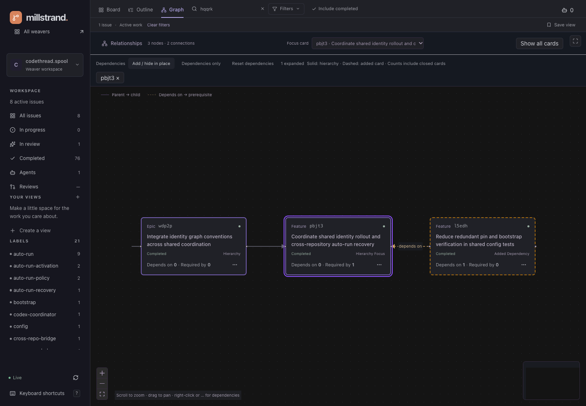
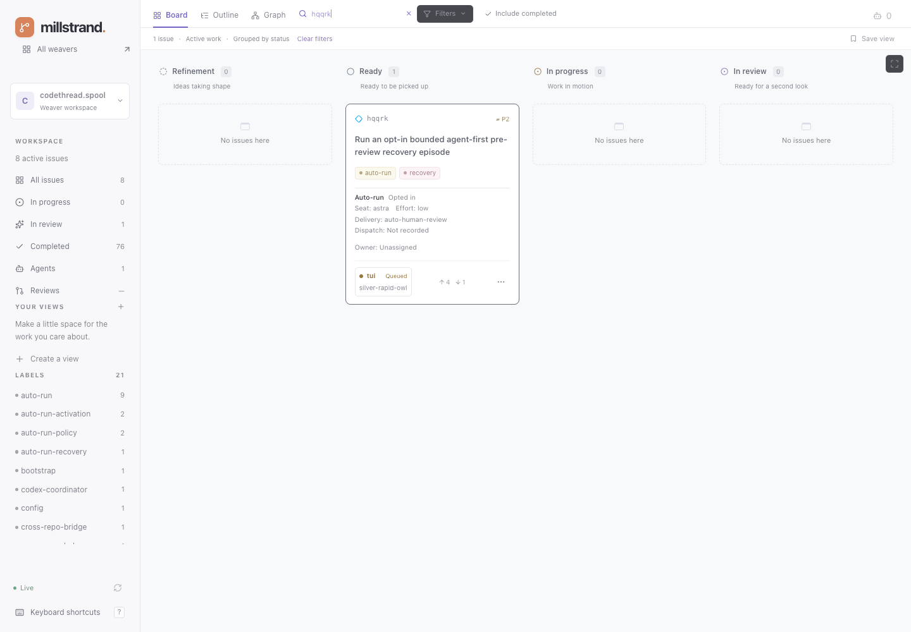
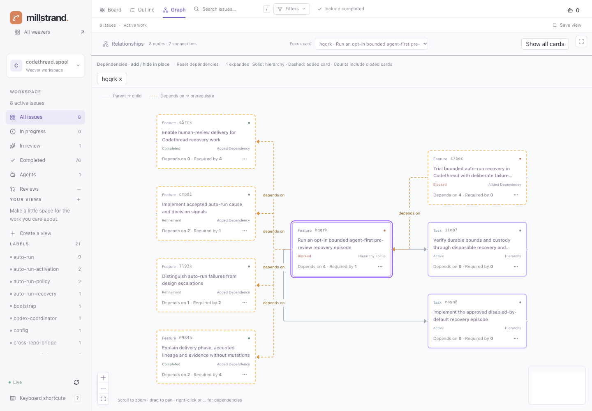
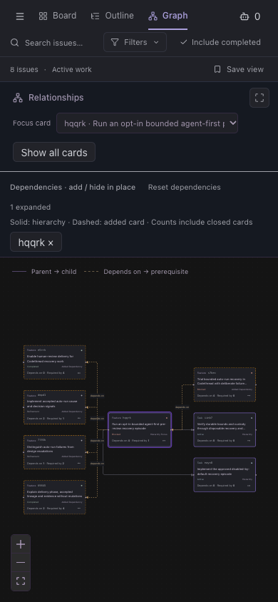
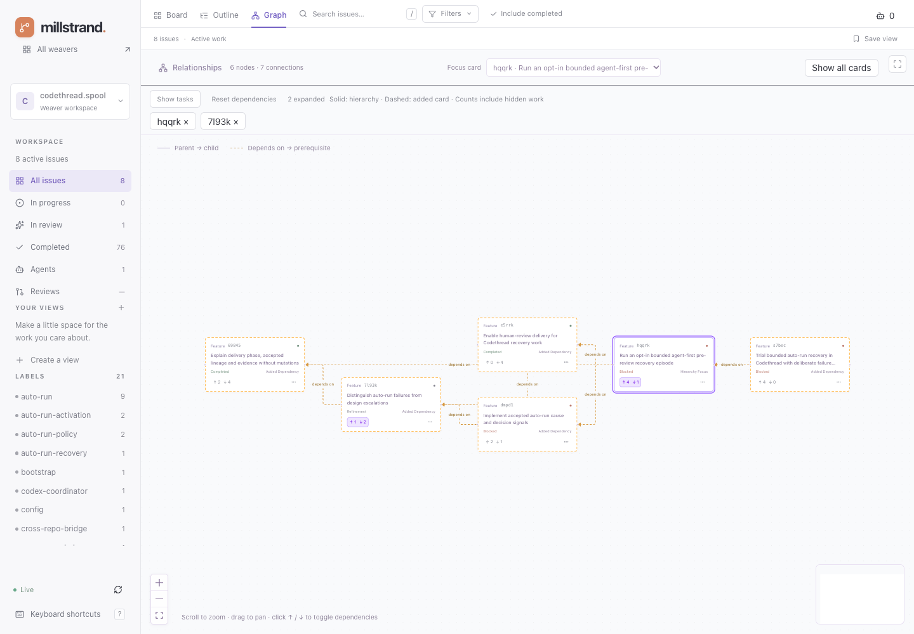
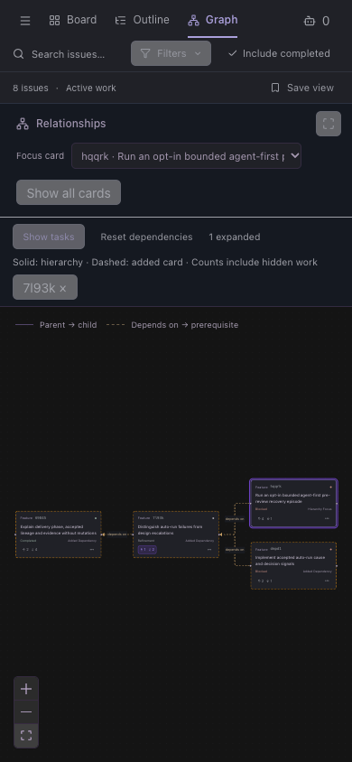

# Graph surface ownership

`IssueSurface` passes the stable `cards`/`allCards` projection from
`useIssueBoard`/`issueSurfaceContent` to `GraphView`. Board startup and retained
board-error feedback stay in the shell. An empty filtered board still mounts the
graph toolbar, so a focused graph is reachable.

- `src/hooks/use-graph.ts`: `useGraphSource` composes board `graphFromCards` or
  the owning epic’s focused `useGraph` query (or the standalone card’s query) (`graphQueryOptions` in `src/lib/api/cards.ts`).
  The mounted graph is the focused query's 10-second poll owner. There is no new
  key, cache, timer or mirrored snapshot. `GraphSource` distinguishes loading,
  unavailable, and successful data with nullable refresh error. A failed refresh
  retains the graph and explicitly labels it last-known; initial failure is not
  rendered as successful empty data.
- `src/components/graph-view.tsx`: Router focus/filter selection, toolbar, source
  notices and memoized layout. `GraphSourceNotice` and `GraphEmpty` render explicit
  loading/error/empty/too-large states. Only graph data, dependency data, URL exploration and includeClosed
  enter layout memoization, never query wrappers or fetchedAt.
- `src/lib/graph.ts`: pure `graphFromCards`, `layoutGraph`, `graphStatus`,
  `graphBody`, and concrete source/layout types. Query structural sharing retains
  unchanged focused graph input; the issue projection retains unchanged board
  input. Dagre stays synchronous and unchanged as the layout engine.
- `src/components/graph-canvas.tsx`: `GraphCanvas` renders React Flow and the
  local task/work inspector. Epic/feature activation delegates to Router issue
  selection. Enter/Space activation matches clicking. Markdown entry
  comes from a shared leaf, not another page implementation.

## Deliberate lifecycle

The canvas key is serialized **URL focus, task visibility, dependency exploration and filter values**, not graph membership
or object identity. The first lazy expansion enters that key only when its first
snapshot arrives, so fit-to-view includes the requested neighbours rather than
fitting the old hierarchy before the request completes. Focus/filter navigation (including Back) resets local inspector
selection and fits the new graph. Workspace/page unmount also resets it. Unchanged
polls, refresh health and ordinary data updates do not remount the
canvas or refit pan/zoom. Membership changes from a poll update the controlled
nodes/edges without forcibly recentering; Fit View remains available. A selected
inspector is shown only while its ID is present in the current layout. Empty and
too-large layouts unmount the canvas; returning to a renderable graph fits again.
The existing navigation contract still clears focus on manual filter changes.

## Semantics

Unfocused graphs include matching issues and their epic context, not unmatched
siblings. Focused graphs retain the focused root and transitive ancestors of live
nodes even if closed; other closed nodes require includeClosed. Parent arrows point
parent → child. Dependency arrows are explicit opt-in and point dependent → prerequisite, while Dagre
positions prerequisites before dependents. Only edges with both actual endpoints
are laid out. An open node with a visible open prerequisite is blocked; the subtree
cannot prove readiness against external dependencies. Empty is explicit; more than
150 visible nodes (after filtering/context inclusion) produces the narrowing notice.

## Verification for 45mjy

`pnpm quality`: strict TS, zero-warning Oxlint, 294 Vitest tests and production
build pass. `src/lib/graph.test.ts` covers shared issue membership/context,
transitive closed ancestors/root, dependency direction/placement/blocking, dangling
edges and the 150-node boundary. `src/components/graph-view.test.tsx` covers source
notices and empty/too-large distinctions.

Browser checks used real local workspace reads at 1440×1000 and 390×844:

- Unfocused and focused graphs; zoom controls and drag pan; keyboard Enter task
  inspector and Space feature detail; pane/inspector close; detail Back and reload.
- Focused and unfocused ordinary polls retained the exact viewport element and
  pan/zoom transform; focused task inspection survived a poll.
- Closed feature vl3cr remained as the sole root when closed tasks were excluded;
  includeClosed plus focus showed all five nodes. Filter change reset the canvas;
  Back restored the URL filter and excluded closed nodes. Zero search matches kept
  the focus selector usable.
- Browser-scoped graph request delay showed loading; initial abort showed error
  without empty prose. Refresh abort retained viewport, transform and inspector
  with last-known feedback. A browser-only 151-node response showed the size notice.
  All request overrides were removed; no database fixtures or real work were mutated
  for smoke testing. No paid agent launch or external review publication occurred.
- Narrow canvas/inspector controls remained usable with document width equal to the
  390px viewport. Browser reported no uncaught page errors.

## Explicit dependency expansion

Click a Graph card’s **↑ / ↓** counts to show or hide its direct dependencies.
The badge has a violet active state and `aria-pressed` while expanded; clicking
again collapses that expansion. Right-click and **…** menus offer the same action.
Board/Outline menus open this graph action directly. Counts are workspace-wide:
**↑ Depends on** (outgoing prerequisites), **↓ Required by** (incoming dependents),
including closed work and hidden tasks. Badge clicks never open the card inspector.

- **Add / hide in place** unions the direct neighbours of explicitly expanded
  cards with the current hierarchy. Expand another card to add another hop.
  Hide it from its menu or removable ID chip; shared nodes/edges remain when
  another expanded card still needs them. **Reset dependencies** restores the
  hierarchy. There is no dependency-only mode.
- Solid violet borders mark the original hierarchy; dashed amber borders and
  **Added dependency** identify added cards. This denotes graph membership, not
  a claim that every added card belongs to another epic. The selected hierarchy
  card has a ring and **Hierarchy focus** label.
- Closed dependency neighbours stay visible even with **Include completed** off.
  Counts are independent of filters; expansion never recurses automatically.
  Zero-count cards have a disabled expansion action unless already expanded,
  so an expansion can still be cleared after its relationships disappear.
- `graphDependencies` is a URL array of unique expanded IDs. Focus/filter changes
  clear it. Back/reload restore it. Discrete exploration refits the canvas;
  ordinary polls retain pan/zoom and selection.

Counts arrive on `Card.dependencies` and `GraphNode.dependencies` through the
existing board/detail/subtree reads. Merely opening Graph, reading counts or
focusing an epic does **not** request the workspace dependency graph.

`GET /api/dependencies` returns a `CardGraph` of workspace-wide dependency edges
and their endpoints. `WorkspaceDatabase.readDependencies` uses one read-only,
bounded SQL snapshot discovered through `mill weaver list`, with existing
schema/storage validation and 10,000-node / 50,000-edge overflow failures. Only
identity, title, lifecycle, timestamps and allowlisted kind/lane metadata are
selected; no arbitrary attributes or agent payloads. No Strand mutations occur.
`StrandData` coalesces concurrent reads and caches a successful snapshot for three
seconds; card mutation settlement invalidates it, including uncertain failures.

`GraphView` owns `['dependencies', workspace]` through `useDependencies` only while
at least one card is explicitly expanded, polling every 10 seconds. Removing the
last expansion disables both fetching and polling, including invalidation reads.
Refresh failures retain the snapshot with last-known feedback; initial expansion
failure leaves the hierarchy and its authoritative counts visible. No per-card
requests or polling owners are added. Card mutations await invalidation of this
key too. `shared/dependencies.ts` provides one unique-link counting projection for
both persisted reads; layout uses indexed blocking/focus lookups, not repeated
node scans or per-node hierarchy traversals.

## Hierarchy focus and counts on all card surfaces (s0c9b)

Use **Focus epic hierarchy** from a graph node’s right-click or **…** menu,
from Board/Outline card menus, or choose **Focus card** in the graph toolbar.
The URL retains the chosen card (`graphRoot`); `graphHierarchyRoot` resolves its
owning epic for the existing subtree query. The graph shows that epic’s family,
including sibling features and tasks, with the chosen card outlined and labelled
**Hierarchy focus**. A standalone card loads its own task subtree. Task nodes
focus through their nearest card; unrelated non-card work cannot invent an epic.
The focused card and its ancestors remain visible even when closed; other closed
work still follows **Include completed**.

**Show all cards** clears the hierarchy focus, dependency exploration, search,
label/status/type/priority filters and saved-view selection. It preserves
**Include completed**. The existing **Fit View** control fits the visible graph.
Hierarchy focus narrows to a card’s family; **Add / hide in place** then adds its
direct dependency neighbours without replacing that context. Both are explicit
opt-in. Back/reload restore the selected scope.

`Card.dependencies` contains required `{ incoming, outgoing }` counts from the
existing persisted board/detail read. `ProvenanceIndex` indexes unique `depends-on`
edges in one pass, including closed neighbours and endpoints outside the hydrated
card/task set. The bounded SQL reads workspace-wide dependency edges so unmarked
work in an exported subtree also receives complete counts. Parent edges do not count. The existing SQL
projection now allowlists `depends-on`; no extra endpoints, cache keys, per-card
requests, or poll owners are introduced for these badges. Board/overview health
continues to mark retained data after a failed refresh.

`CardDependencyCounts` is a query-independent shared leaf used by Board, Outline
(including epic headings), Completed, overview card/target rows, and issue details.
**↑** is outgoing **Depends on**, **↓** incoming **Required by**. Zero is explicit;
click/tap or keyboard-activate the badge for an accessible explanation. Graph keeps
the same arrow/count presentation, but its badge toggles expansion instead of
opening a popover. No data mutations are attached to these controls.

### Verification

`pnpm quality`: 369 tests, strict TypeScript, zero-warning Oxlint, formatting and
build pass. Added coverage for epic/standalone/task focus, selected closed card
retention, direction/deduplication/external-endpoint counts, and accessible zero
badges. Existing graph and persisted-read safety tests still pass.

Browser checks on real Codethread data:

- `pbjt3` resolves to epic `wdp2p`: all 21 family nodes with completed work enabled;
  expansion adds its one direct external dependent (22). With completed hidden,
  the selected closed card and closed epic remain (two), then expansion gives three.
- Show all cards restores the broad graph and clears search; Back restores focus
  and expansion. Reload, standalone focus, keyboard menu activation, card inspection
  and dependency expansion were exercised. A failed epic query retained the same
  viewport and graph with visible last-known feedback; the abort route was removed.
- `hqqrk` displays **↑4 ↓1** in Board, Outline and details, consistent with Graph.
  Completed and overview surfaces also render counts. Badge popovers work by pointer
  and Enter; 390px Outline/Graph layouts have no horizontal document overflow.
  Desktop/light and narrow/dark evidence below. No uncaught browser errors.

## Expansion-only cleanup verification (v5yf5)

The dependency-only option and its selection/layout branches are removed; epic
hierarchy focus remains. `pnpm quality` passes: 374 tests, strict TypeScript,
zero-warning Oxlint, formatting and production build. Regression checks cover
unique directed counts, unhydrated graph endpoints, one-hop/shared-link expansion,
URL arrays and removal of the old mode, disabled dependency queries, retained
refresh errors, coalesced server reads, and success/failure cache invalidation.

Real Codethread browser checks at 1440×1000/light and 390×844/dark:

- Unexpanded `hqqrk` shows three hierarchy nodes and **Depends on 4 · Required by 1**
  with **zero** `/api/dependencies` requests. First expansion loads five neighbours
  and fits all eight nodes after the lazy response arrives.
- Right-click expansion of `7l93k`, then hiding `hqqrk`, retains six nodes including
  shared relationships. Reset restores three nodes; over the next 11 seconds and
  two board polls, **zero** further dependency requests occur.
- Back/reload restore expanded IDs. Ordinary polling and an aborted dependency
  refresh retain the exact viewport element/transform. Initial expansion failure
  retains the hierarchy and its counts; removing the browser route override lets
  polling recover without a server restart.
- Epic focus on closed `pbjt3` retains it and `wdp2p` with completed hidden (two
  nodes); explicit expansion adds its neighbour (three). Show all cards clears scope.
- Keyboard and pointer menus, Board → dependency graph navigation, and Board counts
  remain correct. No dependency-only action remains. Narrow document width equals
  the 390px viewport. No uncaught browser errors; no workspace mutations were used
  for browser checks. All request overrides were removed.

## Task visibility and direct count toggles (oyu89, qnk5d)

**Show tasks** is on by default. Turning it off removes task nodes and incident
edges from both the hierarchy and dependency expansions before the 150-node limit
and layout. It does not clear focus, expanded IDs, or change full dependency counts;
turning it on restores tasks subject to the existing completed-work rules.
`graphShowTasks` is a parsed URL boolean, restored by Back/reload. **Show all cards**
preserves this display choice. No new requests or polling owners are introduced.
The redundant dependency-mode heading is removed.

`CardDependencyCounts` and `GraphDependencyCounts` share arrow markup. Graph uses
an accessible pressed button with a violet border/background for active expansion;
other card views retain the explanation popover. Pointer and Enter/Space activation
share the existing URL expansion action, not a second state store.

Verification: `pnpm quality` passes 380 tests. Pure tests cover hidden hierarchy
and dependency tasks, unchanged counts/expansions, restoration and the size limit;
URL tests cover defaults, malformed fields and round trips. Render checks cover
pressed names, both arrows and zero-count collapse.

Real `hqqrk` browser checks: hiding tasks takes three nodes to one without a
dependency request; badge expansion yields six cards, and clicking again returns
to one. Showing tasks restores eight nodes while expanded. Back/reload preserve
both toggles. Multiple active badges remain distinct, and hiding one expansion
preserves shared links. Pointer, Enter and Space never open card details. Desktop
light and 390px dark layouts have no document overflow or uncaught page errors.

